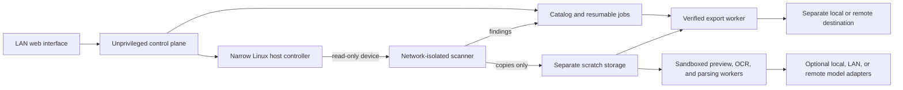

# Reperio

**Find what matters before the disk is gone.**

[](https://github.com/jfrancolopez/Reperio/actions/workflows/quality-gates.yml)

Reperio is a local-first, read-only media discovery and recovery workstation for authorized personal and company storage. It is designed to turn an old hard drive, SSD, USB flash drive, SD/microSD card, CD/DVD/Blu-ray, floppy, Windows/macOS/Linux system, mobile backup, DVR, RAID, or raw medium into a searchable, progressively populated catalog—then help one operator copy and verify the material worth keeping.

> **Current stage:** product direction and implementation backlog are complete; runtime implementation has not started. Reperio is not yet installable or safe to use on a real disk.

## At a glance

| Goal | Reperio's approach |
|---|---|
| Find everything useful | Inventory allocated, trashed, hidden, deleted, orphaned, carved, encrypted, corrupted, older-session, and application-managed artifacts. |
| Avoid system noise | Keep every finding available while ranking user-created and user-manipulated material above operating-system, cache, and application boilerplate. |
| Preserve every category | No user-data category is intrinsically lower value or made unreachable. Engineering priority labels schedule dependencies; they do not decide what is worth saving. |
| Recover wallets safely | Treat Bitcoin, Ethereum/Web3, and other wallet files, backups, keystores, vaults, and recovery indicators as first-class high-value/sensitive findings without querying balances or exposing secrets. |
| Recover before reuse | Preview, dismiss, search, and export findings while a resumable deep scan continues in the background. |
| Preserve the source | Enforce read-only access at the host, kernel, container, process, API, and product-design layers. Reperio will never include wiping or source repair. |
| Stay local by default | Discovery is deterministic and offline. Local or LAN AI is optional; separately enabled remote providers receive only explicit derived content. |
| Remain easy to operate | One disk and one operator per instance, a LAN-accessible web UI, progressive results, notifications, and verified exports to separate storage. |
| Run on Linux | Target Arch Linux/Omarchy and Ubuntu/Debian first, with a validated Unraid/NAS profile. macOS and Windows may open the web UI but are not planned scanner hosts. |

## The operator experience

1. Attach or insert one authorized source medium into a supported Linux host or reader.
2. Start a signed, version-pinned Reperio release.
3. Identify the exact medium using model/serial when available plus capacity, geometry or optical sessions, reader identity, and a sampled media fingerprint.
4. Confirm the source is kernel read-only and scratch/export storage is physically separate.
5. Leave the exhaustive scan running; reconnect or resume after interruption.
6. Browse live findings by photos, video, documents, browser activity, messages, backups, wallets, software, archives, and other useful categories.
7. Export selected originals plus provenance and checksums. Verify the copy independently before deciding what happens to the medium outside Reperio.

Reperio never wipes, formats, initializes, blanks, burns, repairs, repartitions, remounts writable, or deletes from the selected source. Dismissing an item only hides its catalog record and is undoable.

## Planned capabilities

- Allocated-file inventory plus deleted-entry recovery, lost partition discovery, unallocated-space carving, corruption assessment, duplicates, and hidden content.
- USB flash, SD/microSD, CompactFlash, Memory Stick, SmartMedia, MMC and similar cards, including partitionless media, deleted entries, and whole/unallocated-medium carving.
- CD, DVD, and Blu-ray data recovery with track/session inventory, ISO 9660/UDF enumeration, addressable previous sessions, quick-blanked/damaged-media attempts, and honest overwritten/firmware limits.
- DOS FAT12 floppy recovery first, followed by exact fixture-backed legacy formats such as Zip/Jaz, LS-120, magneto-optical, or non-DOS floppies.
- A unified Recycle Bin/Trash view across Windows, macOS, and freedesktop layouts, distinguishing items still in trash from filesystem-deleted or carved remnants.
- First-class Bitcoin, Ethereum/Web3, and extensible multi-chain wallet discovery across allocated files, deleted/carved output, browser profiles, backups, archives, documents, images, and OCR, followed by safe local protected-format recovery where supported. Wallet secrets never go to notifications or remote AI, and Reperio never queries balances, signs, or broadcasts transactions.
- Windows and common removable flash first, followed by macOS, Linux, optical/floppy, mobile backups, nested virtual disks, RAID, DVR/CCTV, and storage-appliance/legacy formats.
- Browser history across operating-system users, browsers, and profiles, with timeline/search/detail views and CSV, JSON, and full-report export.
- Safe photo and video galleries, full-screen derivatives, document/PDF reading, metadata, OCR, transcription, language detection, and translation.
- Recognition of iPhone/Android backups, iMessage, WhatsApp, mail, source code, databases, password vaults, keys, certificates, and protected archives.
- Opt-in, resource-limited local password auditing with operator-supplied passwords, wordlists, rules, and combinations.
- Search, explainable ranking, semantic enrichment, and comparison across zero, one, or several local, LAN, or explicitly enabled remote models.
- Live progress, thresholds, completion/failure notifications, reversible bulk dismissal, and export before the scan finishes.
- Local disk, NAS, SFTP/FTP, WebDAV, S3-compatible, cloud, and other supported remote destinations, with copy verification and manifests.

## Architecture boundary



Only the small Linux host controller can identify and prepare a physical device. The scanner receives that device read-only, without network access. Preview, AI, export, and notification processes never receive a source-device handle. Full trust boundaries and limitations are in the [master plan](docs/MASTER_PLAN.md).

## Safety model

Reperio treats every source medium and its content as hostile:

- The source is selected by stable identity, set kernel read-only, opened `O_RDONLY`, and never mounted in the core workflow.
- Discovered binaries, scripts, macros, shortcuts, extensions, HTML, SVG, and active documents are never executed or served directly.
- Third-party parsers run non-root, without capabilities or network, with a read-only root, bounded resources and output, and strict timeouts.
- Originals, carved bytes, thumbnails, OCR, indexes, reports, checkpoints, logs, and exports can only go to Reperio-owned storage proven separate from the source.
- AI can explain, compare, cluster, translate, and rank; it cannot control discovery completeness, delete data, or permanently hide a finding.
- Real source-media content, credentials, runtime state, recovery output, source images, databases, model files, and wordlists are prohibited from Git.

Direct scanning still stresses the original disk. Failing media can deteriorate, and overwritten, TRIM-discarded, physically unreadable, fragmented, or strongly encrypted data may be unrecoverable. Reperio reports evidence and confidence; it is not a forensic-certification product.

## Building with agents

Git `main` is the implementation source of truth. The current owner workflow uses one checkout, one active implementation agent, and one `RPR-NNN` task at a time. Finish, validate, review, commit, push, and confirm CI for that task before starting the next; do not create parallel worktrees or task branches unless the owner explicitly changes the workflow.

Task packets are coding-agent and LLM vendor/model agnostic. Codex, OpenCode, or another capable agent must be able to work from the same checked-in contracts, fixtures, commands, and acceptance evidence without private context from a previous model.

```sh
make validate
make versions     # reports every package version from one command
```

Package layout (`RPR-004` scaffold): `hostd/`, `api/`, `scanner/`, `worker/`,
`shared/`, `migrations/` (Python), `web/` (placeholder UI), `tests/`,
`fixtures/`, `packaging/`, and `docs/`.

Start with [agent onboarding](docs/AGENT_START_HERE.md), use the [task packet template](docs/AGENT_TASK_TEMPLATE.md), and follow [the contribution workflow](CONTRIBUTING.md). The same dependency-free validation runs locally and in GitHub Actions; external contributions or future multi-review work may use pull requests.

## Project map

| Document | Purpose |
|---|---|
| [Master plan](docs/MASTER_PLAN.md) | Product decisions, safety invariants, architecture, pipeline, UX, providers, release model, and honest limitations. |
| [Threat model](docs/THREAT_MODEL.md) | Assets, trust boundaries, attacker/failure scenarios, prohibited operations, and invariant controls/verifications for the no-write boundary. |
| [Architecture decisions](docs/adr/README.md) | Accepted ADRs (license, host control, no mounts, SQLite jobs, one source, scratch store, sandboxes, optional AI) with reversal conditions. |
| [Implementation backlog](docs/BACKLOG.md) | 191 small, dependency-ordered tasks with deliverables, acceptance criteria, and tests. |
| [Requirements traceability](docs/TRACEABILITY.md) | Maps every confirmed requirement to specification sections and backlog coverage. |
| [Agent start guide](docs/AGENT_START_HERE.md) | Exact workflow for giving bounded work to implementation agents. |
| [Agent task template](docs/AGENT_TASK_TEMPLATE.md) | Reusable task packet that smaller models can follow without guessing. |
| [Repository rules](AGENTS.md) | Non-negotiable safety, hostile-content, testing, and scope rules for every agent. |
| [Contributing](CONTRIBUTING.md) | Branch, validation, pull-request, dependency, and completion-report process. |
| [GitHub setup](docs/GITHUB_SETUP.md) | One-time ruleset and repository-security settings needed after the first push. |
| [Pre-push audit](docs/REPOSITORY_AUDIT.md) | Point-in-time repository findings, implemented controls, and remaining manual actions. |
| [Security policy](SECURITY.md) | Private vulnerability reporting and current support boundaries. |

## Delivery sequence

1. **M0 — Safety and contracts:** prove the no-write boundary, create synthetic fixtures, and establish schemas and repository quality gates.
2. **M1 — Allocated Windows MVP:** inventory NTFS/FAT/exFAT, locate wallet/vault/key artifacts, show live findings, and export verified local copies.
3. **M2 — Deep Windows and removable media:** add deleted/trash recovery, carving/resume, browser history, flash cards, optical sessions, FAT12 floppies, previews, OCR, application artifacts, and notifications.
4. **M3 — Intelligence and protected files:** add multi-model enrichment, semantic search, and bounded password workflows.
5. **M4 — macOS, Linux, mobile, RAID, DVR, and legacy media:** expand only when fixture-backed support proves each exact capability.
6. **M5 — Release:** signed multi-architecture images, a version-pinned installer, fault testing, operator documentation, and acceptance evidence.

## Authorization and license

Use Reperio only on media you own or are explicitly authorized to examine. The operator is responsible for applicable workplace policy, privacy, retention, and legal requirements.

Reperio is licensed under the [Apache License 2.0](LICENSE). Reciprocal-licensed third-party tools are invoked only as separate, unmodified programs and must satisfy the [dependency intake checklist](docs/DEPENDENCY_INTAKE.md); the machine check in `scripts/check_dependency_licenses.py` rejects dependencies that are missing license metadata or fall outside the [license policy](scripts/dependency-license-policy.json). See [ADR 0001](docs/adr/0001-project-license.md) for the decision and reversal conditions.
