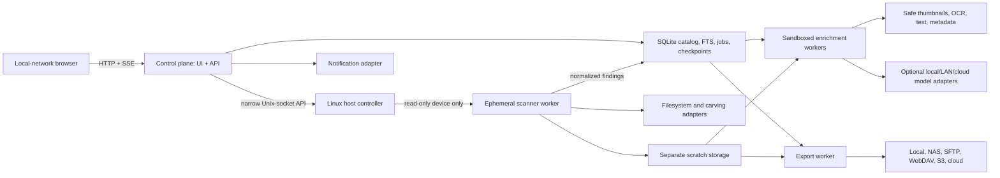

# Reperio master plan

Status: approved product direction; implementation not started
Plan version: 1.1
Last updated: 2026-08-10

Version 1.1 expands the source model from disks to removable flash/cards, optical discs, floppies, and validated legacy adapters; it also makes cross-platform Trash/Recycle Bin reconstruction explicit.

This document is the product and architecture source of truth. `BACKLOG.md` is the execution source of truth. If the two disagree, resolve the disagreement in both documents before implementing the affected feature.

## 1. Product definition

Reperio is a single-operator, local-first media discovery and recovery application for authorized personal and company-owned storage. It performs a slow, exhaustive, resumable scan directly against one physical source medium, creates a searchable catalog while scanning, and allows selected material to be copied to separate local or remote storage. A source may be a hard drive, SSD, USB flash drive, SD/microSD or other memory card, optical disc, floppy, or a later validated legacy-media adapter.

Reperio is deliberately not a disk-cleaning product. It will contain no wipe workflow and no source repair workflow. A user may destroy or reuse a disk with other tools only after independently deciding that Reperio's exports are sufficient.

### 1.1 Desired outcome

An operator can attach an old Windows, macOS, Linux, mobile-backup, DVR, RAID, or raw disk; insert a CD, DVD, Blu-ray, or floppy; or connect removable flash media and answer:

- What allocated, hidden, deleted, orphaned, and signature-carved files are recoverable?
- What is still present in Windows Recycle Bin, macOS Trash, or freedesktop Trash, and what deleted content can be reconstructed after those locations were emptied?
- Which optical sessions, tracks, older directory trees, or reusable-media remnants are readable, and what limitations prevent deeper recovery?
- Which findings are likely personal or user-manipulated rather than operating-system noise?
- What photos, videos, documents, archives, messages, backups, source code, databases, wallets, password vaults, and software artifacts exist?
- Which files are encrypted, password-protected, corrupted, duplicated, or only partially recoverable?
- Which users and browser profiles existed, and what browsing, download, bookmark, search, and session history can be reconstructed?
- What can be previewed, searched, translated, dismissed, restored, or exported now, even if the scan is unfinished?
- Where did each finding come from, how confident is its classification, and was its exported copy verified?

### 1.2 Success criteria

The product is successful when an operator can:

1. Install a signed, version-pinned release on a supported Linux host with one documented command.
2. Positively select an external source using drive facts plus media-specific identity: model/serial/transport when available, and capacity, geometry, table of contents, session layout, and sampled media fingerprint where removable media has no stable serial.
3. Start a deep scan that cannot write to the source even if the UI, AI, or a parser is compromised.
4. Disconnect or restart the application and resume completed stages without repeating successful work; sector carving resumes from a durable checkpoint where the underlying tool supports it.
5. Browse findings and export verified originals while later scan stages continue.
6. View useful categories rather than an undifferentiated flood of Windows DLLs, browser caches, and OS artwork.
7. Export complete browser-history reports grouped by operating-system user, browser, and browser profile.
8. Use no AI, a LAN/local model, several comparison models, an approved cloud provider, or a mixture of these without changing the deterministic discovery pipeline.

## 2. Confirmed product decisions

| Area | Decision |
|---|---|
| Authorization | The operator confirms ownership or explicit authority for every source medium. |
| Scan mode | One deep scan mode. No fast-scan product mode. Individual stages may still expose progress. |
| Source | One physical source medium per Reperio instance: disk, SSD, flash drive, memory card, optical disc, floppy, or validated legacy adapter. One reader containing one inserted medium counts as one source. |
| Acquisition | Direct source-medium scanning; Reperio does not create a forensic image. |
| Working storage | Persistent state/checkpoint storage and separate scratch storage are required. Scratch contains extracted/carved copies and derivatives, not a disk image. RAM-only operation cannot support exhaustive carving and reliable resume on large disks. |
| Coverage | Allocated files, logical trash/recycle items, deleted entries, older optical sessions, lost/deleted partitions, unallocated-space carving, corrupted artifacts, and recoverable content. |
| Priority | Windows disks and FAT/exFAT removable flash first, macOS second, Linux third, optical/floppy next, then RAID/DVR/raw/proprietary and other legacy formats. |
| Source mutation | Prohibited permanently: no write, delete, repair, wipe, initialize, format, optical burn/blank, or partition modification. |
| Review | Findings appear progressively and remain reviewable/exportable before scan completion. |
| Dismissal | Bulk dismiss is allowed, reversible, and catalog-only. |
| Previews | Sensitive content is not hidden. Safe thumbnails and full-screen preview are desired. |
| Access | Browser UI available on the local network. Authentication is optional and disabled unless configured. |
| Users | One administrative operator; no multi-user roles. |
| AI | Optional. Multiple ordered providers can run independently and comparison/disagreement is visible. |
| Languages | English and Spanish directly; detect other languages and offer adjacent or tooltip translation. |
| Exports | Local disks, NAS, SFTP/FTP, WebDAV, S3-compatible/cloud destinations, and other rclone-supported remotes. |
| Notifications | Progress, noteworthy-count thresholds, pause/failure, export completion, and scan completion through email or third-party notification routes. |
| Password work | Detect protected artifacts, try supplied passwords, then opt-in wordlists/rules/combinations with local John the Ripper or Hashcat workers. |

## 3. Non-negotiable safety invariants

These properties are requirements, not implementation suggestions.

### 3.1 No source writes

1. A disk or flash device uses a stable `/dev/disk/by-id` identity when available. Media without a stable device ID—especially a disc or floppy inserted into a reusable drive—uses the stable reader identity plus capacity/geometry, table of contents or session facts, and a newly sampled media fingerprint. A bare path such as `/dev/sdb`, `/dev/sr0`, or `/dev/fd0` is never sufficient by itself.
2. The host controller asks the Linux kernel to set the entire selected device read-only and verifies the flag before a scan starts.
3. The source and its partitions must not remain mounted read-write. The start screen clearly reports mounted state.
4. The control plane, UI, model providers, export workers, notification workers, and preview workers never receive a source-device handle.
5. Only an ephemeral scanner receives the chosen device. It receives device-cgroup read permission only, runs without Linux capabilities, has no network, and opens the device `O_RDONLY`.
6. Filesystem analysis uses parsers against the device rather than mounting the source in the core workflow.
7. Recovered and carved bytes go to a scratch/export device proven not to be the source or one of its children.
8. The application has no API route, command, plugin permission, or UI control for destructive source operations.
9. Automated integration tests use sacrificial block, optical, and floppy-style fixtures and prove that attempted writes fail at every applicable layer. Hardware acceptance tests cover representative readers before support is advertised.

Reperio necessarily writes its own catalog, checkpoints, scratch copies, derivatives, and requested exports. The read-only guarantee applies to the selected source device and its contents. Completed recovered copies are not automatically deleted. Only incomplete temporary files may be cleaned according to a documented owned-state policy; uninstall preserves Reperio state unless the operator separately requests its removal.

### 3.2 Untrusted-content isolation

A disk can contain intentionally malicious images, archives, documents, fonts, databases, browser artifacts, media, or executables. Therefore:

- No discovered program, macro, script, shortcut, installer, or active document content is executed.
- Every third-party parser runs in a version-pinned sandbox with no network, no source device, no capabilities, non-root identity, read-only root filesystem, bounded scratch space, CPU/memory/PID limits, output-size limits, and a timeout.
- Archives are never extracted directly into a shared path without traversal, symlink, decompression-bomb, and nesting checks.
- The web UI never directly renders source HTML, SVG, JavaScript, or active PDF content. It shows escaped text or safe rendered derivatives.
- Cloud or LAN AI receives only explicit extracted text or safe derivatives, never arbitrary filesystem access or tools.

### 3.3 Export separation

- A source item is never considered backed up merely because it appears in the catalog.
- An export is complete only after the destination copy is checked by size and SHA-256 where the destination supports reading/checksums.
- The export manifest records failures and unsupported verification methods.
- Reperio never silently uses the source medium or its backing device as scratch or export storage.

## 4. Honest limitations

The UI and documentation must communicate these limitations without implying forensic certainty:

- Overwritten, TRIM-discarded, physically unreadable, strongly encrypted, or fragmented carved data may be unrecoverable.
- Flash controllers may discard or remap deleted blocks through TRIM, garbage collection, and wear leveling. Continued use of a USB drive or memory card can overwrite recoverable clusters even when the visible files appear unchanged.
- Optical recovery depends on media type, drive firmware, readable table-of-contents/session metadata, physical condition, and whether sectors were actually overwritten. Earlier append-only sessions and some quick-blanked rewritable discs may remain readable; fully overwritten DVD-RW/DVD+RW/BD-RE content may not. Reperio reports only sessions and sectors the drive can address.
- Floppies commonly have bad sectors, ambiguous geometry, weak metadata, and reused clusters. Deleted filenames or initial clusters may survive while the rest of the file does not; confidence and partial state must remain visible.
- Direct scanning repeatedly reads the original. A mechanically failing disk can deteriorate during a long scan. Reperio reports SMART and I/O-error signals and can pause, but it does not image the drive. The operator may use an external imaging/recovery specialist outside Reperio.
- A direct scan cannot guarantee an identical view if the device is disconnected, altered elsewhere, re-enumerated, or replaced in the same reader. Resume is allowed only after the full media identity—including geometry or optical session/TOC facts where applicable—and sampled fingerprints match.
- A deep direct scan is not RAM-only. Deleted-space carving can recover hundreds of gigabytes, and durable resume requires persistent checkpoints. The operator must provide separate local or network-backed scratch storage sized for the expected recovered content.
- Filesystem timestamps do not prove human action. Reperio reports evidence and confidence, not an absolute claim that a user manipulated a file.
- Deleted browser history, private browsing, cleared SQLite pages, cache artifacts, and synchronized history have different evidentiary quality. The UI identifies the source parser and recovery condition.
- Password auditing has no guaranteed finish time or result. It is opt-in, locally executed by default, pauseable, and resource-limited.
- Enabling a cloud model or remote translation can disclose selected content outside the local network. The operator must explicitly enable each remote provider.
- An unauthenticated LAN UI exposes sensitive findings to anyone who can reach it. Reperio supports that requested mode but displays a persistent warning and offers a simple single-admin password and subnet restrictions.

## 5. Platform and deployment model

### 5.1 Supported first release

- Scanner host: modern Linux with systemd, Docker Engine or Podman, `amd64` or `arm64`.
- User interface: current desktop browser on Linux, Windows, macOS, or a tablet on the same network.
- Source transport: USB/SATA/SAS block devices; USB/PCIe SD, microSD, CompactFlash, Memory Stick, MMC and similar readers; Linux optical devices; and supported floppy controllers/USB floppy readers. A medium is supported only when Linux exposes a reliable read path and the adapter's fixture/hardware matrix passes. SMART is unavailable for many readers and media, so scanning continues with a capability warning rather than invented health data.
- One active source medium per installed instance. A second simultaneous source requires a second isolated Reperio instance; sequential one-at-a-time media cases remain available in the same catalog.

### 5.2 “One command” installation

The convenience entry point will resemble:

```sh
curl -fsSL https://example.invalid/reperio/install/v1.0.0 | sudo sh
```

The real release URL will be created later. The installer must:

1. Be version-pinned; `latest` may be offered only as an explicit choice.
2. Verify host architecture and supported Linux features.
3. Download a signed release manifest and verify checksums/signatures before installing binaries or pulling OCI images.
4. Pin every OCI image by digest.
5. Install the narrow host controller and its system service.
6. Create dedicated state, scratch, and secrets directories with restrictive permissions.
7. Start the control plane and print the local URL, LAN URL, safety status, and uninstall instructions.
8. Never make a source-media selection or begin scanning during installation.

Piping a network script into a privileged shell is inherently sensitive. Releases must also offer a download-verify-run sequence and packages so cautious operators can inspect before execution.

### 5.3 Portability boundary

The containerized control plane is portable. Reliable physical raw-device access is host-specific. Linux is the first scanner platform. Later Windows and macOS host agents may communicate with the same control-plane contract, but raw disks will not be advertised as supported through Docker Desktop alone.

## 6. System architecture



### 6.1 Linux host controller

The host controller is the smallest privileged component. It must not contain parsing, AI, preview, export, or general shell functionality. Its allowlisted responsibilities are:

- Observe block-device and removable-media add/remove/change events and return sanitized reader and inserted-medium facts.
- Resolve a selected stable device/media identity to the current kernel path without trusting the path as identity.
- Report parent/child relationships, mounts, holders, RAID/LVM membership, capacity, sector sizes or geometry, transport, model, serial, optical TOC/sessions, and media-change generation.
- Read SMART/health information where supported.
- Set and verify the kernel read-only flag.
- Launch, monitor, pause, resume, and stop the single scanner with a fixed container specification.
- Refuse internal system disks by default and require an explicit, strongly worded override for a disk containing the active root/boot/state filesystem.
- Maintain a minimal append-only safety audit of device identity, read-only verification, and scanner launch parameters.

The control plane must not mount the Docker socket. It communicates with host controller through a narrow versioned Unix-socket protocol.

### 6.2 Control plane

Recommended stack:

- Python 3.12+ and FastAPI for the versioned REST API.
- React and TypeScript, built as a static SPA, for the UI.
- SQLite in WAL mode for configuration, findings, durable jobs, review state, FTS5, checkpoints, and event outbox.
- Server-Sent Events for progressive status and finding counts. Polling remains a fallback.
- Alembic-style numbered migrations from the first schema.

SQLite is intentional: one scanner and one operator do not justify PostgreSQL, Redis, Celery, or Kubernetes. Long work is represented by durable database jobs claimed by one worker. Optional future scaling must preserve the job contract.

### 6.3 Scanner worker

The scanner is an ephemeral, network-isolated process with the selected source device exposed read-only and separate checkpoint/scratch mounts. The source may be a disk/flash block device, optical device, floppy, or validated legacy adapter. It runs adapters through structured subprocess wrappers and emits normalized records. It does not serve HTTP and does not know provider or destination credentials.

The worker is restartable. Every stage has an idempotency key, state, input identity, tool version, cursor/checkpoint, counters, timestamps, structured error, and retry policy.

### 6.4 Enrichment workers

Enrichment workers operate only on extracted copies or bounded byte streams placed in scratch storage. Separate sandbox profiles are used for:

- Document and archive parsing
- Image/media metadata and previews
- OCR
- Audio/video transcription
- Browser and application artifact parsing
- Language detection and translation
- Local embeddings and AI classification
- Password auditing

Network is disabled unless the specific configured provider/destination requires it. A network-enabled provider worker never receives arbitrary paths or a source device.

## 7. Deep-scan pipeline

The product has one deep scan composed of observable stages. Stages can overlap only when dependencies and I/O pressure permit. Default concurrency is conservative for old rotational disks.

### Stage A: source validation and health

1. Resolve stable reader/device identity and record media facts. For removable media, fingerprint the inserted medium separately from the reusable reader and detect media-change events.
2. Verify destination/state storage does not share the source physical backing device.
3. Record mount/holder state and set kernel read-only.
4. Read partition tables, floppy geometry, or optical TOC/track/session metadata without modifying the medium.
5. Read SMART/health data where available and warn about reallocated, pending, uncorrectable, temperature, transport, media-change, or read-error signals. Report `unavailable` for readers that expose no health interface.
6. Create a resume fingerprint using immutable device/reader facts, media geometry or session facts, and small sampled hashes from non-secret sector ranges. Do not hash the full source before scanning.

### Stage B: volume discovery

- Discover GPT, MBR, extended, Apple, BSD, LVM, mdraid, and recognizable lost partition candidates.
- Detect partitionless “superfloppy” filesystems commonly used by memory cards and USB flash devices.
- For optical media, enumerate data/audio tracks and every addressable session rather than treating only the newest directory tree as the whole source.
- Detect filesystem and encryption/container signatures.
- Create volume/session/track records with offsets, sizes, confidence, parser support, allocation or historical state, and locked/unlocked state.
- Do not repair or write a partition table.

### Stage C: filesystem enumeration

- Use The Sleuth Kit as the initial cross-filesystem enumerator because it can analyze NTFS, FAT12/16/32, exFAT, APFS, HFS, ext-family, UFS, ISO 9660, and other validated formats without mounting.
- Add Dissect as a complementary parser where it improves artifact access or filesystem coverage.
- Add dedicated read-only optical adapters for ISO 9660/Joliet/Rock Ridge, UDF, track tables, and previous-session directory trees where the generic parser lacks coverage. These adapters receive no write-capable device access or output-drive command.
- Enumerate allocated, deleted, orphaned, hidden, alternate data streams, metadata-only, sparse, symlink, and special entries where the filesystem exposes them.
- Normalize paths, filenames, users/owners, timestamps with raw values and timezone interpretation, sizes, allocation state, attributes, object IDs, and physical extents.
- Stream SHA-256 when extracting a finding. Avoid reading the same content repeatedly by sharing a content-addressed scratch object.

### Stage D: deterministic classification and noise scoring

Before AI, assign reproducible signals:

- File signature/MIME versus extension
- Path and operating-system role
- User profile ownership and well-known personal/application locations
- Installed application evidence
- Known OS package/cache/temp paths
- Executable/library/driver status
- Browser cache versus explicit download/bookmark/history artifact
- Media EXIF/device/editor fields
- Document author/application metadata
- Archive membership
- Hidden/system attributes
- Deleted/carved/partial condition
- Exact-content and perceptual duplicates

Each finding receives independent values:

- `interest_score` from 0 to 100
- `noise_score` from 0 to 100
- category labels
- evidence codes explaining every score contribution
- confidence (`certain`, `high`, `medium`, `low`, `unknown`)

Nothing is automatically deleted or permanently hidden. Default views suppress high-noise system material but provide “include system/noise” and explain why an item was deprioritized.

### Stage E: artifact discovery

Artifact locators search all user profiles and application paths for:

- Chromium-family, Firefox, Safari, Internet Explorer/legacy Edge, Tor Browser, and portable-browser profiles
- Email stores and address books
- Messaging media/databases including iMessage, WhatsApp, and supported desktop/mobile backups
- iTunes/Finder iOS backups and Android backup/extraction layouts
- Photo libraries and catalogs
- Cloud-sync roots and offline files
- Virtual machines, disk images, backup catalogs, and archives
- Wallet files, wallet applications, seed/backups, password vaults, keys, and certificates
- Databases, source repositories, scripts, installers, and licensed application data
- Windows `$Recycle.Bin`, macOS user/volume Trash, and freedesktop Trash layouts, preserving original path/deletion-time metadata where present and linking still-allocated payloads to deleted/carved copies

Detection produces an artifact record even if parsing fails, so unsupported or encrypted data remains visible.

### Stage F: metadata, previews, and text

- Apache Tika for document type detection, metadata, and text extraction.
- ExifTool and `ffprobe` for media metadata.
- `libvips` for low-memory image thumbnails and safe display derivatives.
- FFmpeg for bounded video keyframes, audio waveforms, and normalized previews.
- Tesseract/OCRmyPDF for image and scanned-PDF OCR, producing only scratch derivatives.
- Optional local speech-to-text for audio and video.
- Language detection on extracted text; English/Spanish display directly and other languages receive an on-demand side-by-side translation.

Thumbnail policy is tiered:

1. Read embedded thumbnails where safe.
2. Generate a small masonry thumbnail on demand or in low-I/O background windows.
3. Generate a larger preview only when opened.
4. Cache by content hash so duplicates share derivatives.
5. Never block filesystem enumeration on thumbnail completion.

### Stage G: deleted-space carving

- Use PhotoRec as the initial signature-carving engine. It operates read-only and supports durable session resume.
- Apply filesystem-aware deleted-entry recovery before raw carving on FAT12/16/32, exFAT, NTFS, ext, and other validated formats. A partitionless memory card or floppy is scanned from its filesystem start; a partitioned flash device uses each volume plus remaining unallocated ranges.
- For optical media, scan addressable older sessions and obsolete directory trees first, then carve readable sectors. Quick-blanked or damaged rewritable media is attempted only when the drive exposes a nonzero readable range; fully overwritten or firmware-hidden sectors are reported as unavailable, not “empty.”
- Carved outputs are written only to scratch storage and immediately ingested, hashed, classified, and linked to source offsets.
- Record that carved names and dates may be synthetic or unavailable.
- Deduplicate carved content against allocated/deleted filesystem entries without discarding provenance.
- Keep corrupt or partial output when the configured policy allows it, with a visible health label.

### Stage H: password and corruption workflows

- Detect protected ZIP/7z/RAR, PDF, Office, OpenDocument, disk/container, wallet, vault, key, and backup formats.
- Try operator-supplied passwords and named password sets before compute-intensive work.
- Extract audit material into isolated scratch using format-specific `*2john` or `*2hashcat` helpers.
- Run John the Ripper or Hashcat locally with configurable dictionaries, rules, masks/combinations, resource schedules, and time budgets.
- Never print candidate or recovered passwords in logs or notifications.
- Successful decryption produces a separate scratch copy; original bytes and protected status remain intact.
- File repair/regeneration runs only against copies in scratch and preserves the damaged original copy. No repair tool receives the source device or reader.

### Stage I: semantic enrichment

- Full-text search works without AI.
- Local embeddings enable semantic search when the host supports the configured embedding model.
- LLMs summarize, tag, rank, translate, cluster, and explain findings. They do not enumerate the filesystem and cannot cause source or catalog deletion.
- Model calls are batched after deterministic extraction and cached by content hash, prompt version, provider, and model.

## 8. Browser-history subsystem

Browser history is a first-class tab and export, not a generic document category.

### 8.1 Required browser coverage

Initial Windows priority:

- Chrome, Edge, Brave, Opera, Vivaldi, Chromium, Firefox, Tor Browser
- Multiple Windows users and multiple browser profiles
- Legacy Internet Explorer/Edge WebCache where parsers support it

Later macOS/Linux coverage:

- Safari, Chrome/Chromium family, Firefox, and installed derivative browsers
- All discovered OS users and profiles

### 8.2 Artifact types

- Visits and typed URLs
- Page title, normalized URL, domain, scheme, query, fragment policy
- First/last visit, visit count, transition/referrer where available
- Downloads with original URL, target path, size, status, danger/interruption fields where available
- Bookmarks/favorites and folders
- Search terms where recoverable
- Sessions/tabs and recently closed entries where recoverable
- Cookies and form/autofill metadata as separately sensitive artifact types; do not automatically expose reusable authentication tokens
- Cache records and locally recoverable cached objects
- Extensions and browser-version/profile facts
- Deleted or carved SQLite records where a validated parser can identify them

### 8.3 Normalization and confidence

Every row records operating-system user, browser, profile, artifact type, source path/object ID, source table/parser, raw timestamp, normalized UTC timestamp, display timezone, recovery state, and confidence. WAL/SHM companion files must be considered when present. Critical values should be cross-validated with a second parser or fixture, not assumed from a single tool.

### 8.4 Browser-history UX

- Summary cards by user, browser, profile, date range, domain, visits, downloads, and bookmarks.
- Search, date histogram, domain aggregation, timeline/table views, and duplicate-collapse controls.
- One click from a history record to related cached/downloaded file findings.
- Export the current filter or the complete dataset to CSV, JSON, and a standalone HTML report with provenance and timezone notes.
- Progressive results while later carving and cross-validation continue.

## 9. Review and user-interface design

### 9.1 Main navigation

1. Dashboard
2. Live scan
3. All findings
4. Photos
5. Videos and audio
6. Documents and PDFs
7. Browser history
8. Messages and email
9. Archives and encrypted items
10. Backups and mobile data
11. Wallets, vaults, keys, and sensitive artifacts
12. Software, source code, and databases
13. Trash and Recycle Bin
14. Deleted and carved
15. Unknown and unsupported
16. Exports
17. Settings and diagnostics

### 9.2 Progressive live experience

The live-scan screen shows:

- Source medium and reader identity, media type, read-only status, and whether the medium changed since the case began
- Current stage and subtask
- Bytes/sectors examined where meaningful
- Volumes, filesystem entries, findings, deleted entries, carved files, errors, and recoverable bytes
- Counts by category and newly discovered high-interest artifacts
- Per-stage status: pending, running, paused, retrying, completed, completed-with-warnings, failed, skipped-unsupported
- Estimated percentage only when a denominator is credible; otherwise show activity and completed units rather than a deceptive ETA
- Pause/resume and safe stop; no action that writes, blanks, burns, formats, or repairs the source medium

The source selector groups whole disks, flash devices/memory cards, optical drives with inserted media, and floppy/legacy readers. It displays capacity, transport, filesystem hints, physical write-lock signal when available, kernel read-only proof, optical sessions/tracks, and any missing identity evidence. When a disc or floppy is replaced in the same drive, the previous case remains closed/disconnected and the new medium requires a fresh selection; it is never silently treated as a resume.

### 9.3 Finding interactions

- Grid, masonry, compact table, and timeline views as appropriate to content.
- Persistent filter chips: user, volume, category, date, size, allocation state, confidence, interest, noise, encrypted, corrupted, duplicate, exported, dismissed.
- Multi-select across virtualized result sets.
- Dismiss selected, undo recent dismiss, view dismissed, restore selected.
- Add to export queue at any time.
- Full-screen safe preview with metadata, extracted text, translation, provenance, related items, duplicate group, and model opinions.
- Never require scan input after initial configuration; failures follow retry/skip policies and produce notifications.

### 9.4 Media UX

Photos and video use a responsive masonry layout inspired by established visual-discovery products without copying proprietary branding or source code. Requirements include virtualized/infinite scrolling, aspect-ratio placeholders, keyboard navigation, selection without opening, date/location/device grouping, full-screen lightbox, metadata panel, related/duplicate navigation, and safe video playback from a generated derivative or exported copy.

### 9.5 Accessibility and responsiveness

- Keyboard-complete selection and navigation
- Visible focus, semantic labels, sufficient contrast, reduced-motion mode
- Responsive desktop/tablet layout
- No color-only status meaning
- Large result sets remain responsive through cursor pagination and virtualization

## 10. Catalog and data model

The physical schema can evolve, but the following concepts are mandatory:

- `source_devices`: stable reader/controller identity, model, serial, transport, capabilities, current kernel path, safety state
- `source_media`: source kind, device relationship, capacity, sectors/geometry, write-protect signals, TOC/session facts, sampled fingerprint, insertion/change generation
- `scan_cases`: source medium, configuration snapshot, status, start/end, app version
- `volumes` and `media_sessions`: offsets, partitions/tracks/sessions, filesystem/encryption types, historical/current state, confidence, unlock state
- `jobs`: stage, state, lease, idempotency key, attempt, progress, checkpoint, errors
- `filesystem_entries`: parent/object IDs, path, names, attributes, allocation state, raw/normalized timestamps, extents
- `contents`: content hash, size, scratch location, health, extraction state, reference count
- `findings`: entry/content link, category, interest/noise, confidence, review state, export state
- `evidence`: finding, rule/parser/model, reason code, version, value, confidence
- `artifacts`: application/browser/backup/wallet/etc. instance and owning OS user/profile
- `trash_records`: platform/user, original path, deletion time, metadata/payload linkage, present/deleted/carved state, parser confidence
- `browser_events`: normalized browser records with raw provenance
- `derivatives`: thumbnail, preview, OCR, transcript, translation, rendered page, waveform
- `model_runs` and `model_opinions`: prompt/schema versions, provider/model, result, usage, error, agreement group
- `password_targets` and `password_jobs`: protected format, audit status, secret reference, never plaintext logs
- `dismissal_events`: reversible review event history
- `export_destinations`, `export_jobs`, `export_items`, `export_verifications`
- `notifications`: rule, event, delivery attempt, redacted error
- `audit_events`: safety- and configuration-relevant operations

Paths are data, not identifiers. Stable internal IDs must survive renames, duplicate paths, unusual encodings, and carved files with no original path.

## 11. AI and model-provider architecture

### 11.1 Provider types

1. `none`: deterministic pipeline only.
2. OpenAI-compatible HTTP endpoint for LAN services such as vLLM, llama.cpp servers, LM Studio, or compatible gateways.
3. Ollama native adapter.
4. Generic embeddings endpoint.
5. Official provider API adapters where the operator elects to configure supported credentials.
6. Experimental official-CLI adapters authenticated interactively by the operator.

OpenAI's official documentation states that Codex clients can sign in with ChatGPT for subscription access or an API key, and that API keys remain the normal path for general API calls and programmatic automation. Reperio may therefore investigate a Codex CLI adapter that invokes the official client without scraping or proxying its credentials. It must be labeled experimental until terms, unattended behavior, structured output, data handling, and failure modes are validated. See [OpenAI authentication documentation](https://learn.chatgpt.com/docs/auth).

Claude Code officially supports Claude Pro/Max login, and Gemini CLI supports Google-account login. Any adapter must call the unmodified official CLI as the logged-in operator; it must never harvest OAuth tokens or impersonate an API. Provider terms can change, so CLI adapters have capability checks and can be disabled without affecting scanning. See [Claude Code setup](https://docs.anthropic.com/en/docs/claude-code/getting-started) and [Gemini CLI authentication](https://github.com/google-gemini/gemini-cli/blob/main/docs/get-started/authentication.mdx).

### 11.2 Ordered comparison

Settings allow any number of named provider profiles with priority and workload eligibility. For a comparison-enabled task:

1. Create one immutable input package from extracted text/metadata/safe images.
2. Send the same schema and task to each eligible provider independently.
3. Validate structured output; retry only transient failures.
4. Store each opinion without exposing other models' answers.
5. Produce deterministic agreement metrics and a consensus label where justified.
6. Display agreements, disagreements, confidence, provider/model, and evidence.

No majority vote may delete, dismiss, overwrite, or make a finding inaccessible.

### 11.3 Privacy controls

- Local-only is the default provider policy.
- Each remote provider is disabled until the operator acknowledges that selected content leaves the host/network.
- Provider profiles specify eligible categories and maximum bytes/pages/images.
- Secrets use the host secret store and never appear in scan configuration snapshots.
- Model input/output retention is configurable; hashes and summary provenance remain even if payloads are purged.

## 12. Export design

Rclone is the preferred broad destination adapter because it supports local filesystems, SMB, SFTP, FTP, WebDAV, S3-compatible storage, and many cloud services through a common interface. Direct local-copy support remains first-party so the minimum install does not depend on remote configuration.

### 12.1 Export package

Each export can include:

- Original or recovered file bytes
- Safe relative path preserving source hierarchy where possible
- Collision-resistant name for carved/duplicate/path-invalid items
- SHA-256, size, original path/object ID, timestamps, allocation/recovery state
- Selected metadata, OCR/text/transcript/translation when requested
- Browser-history CSV/JSON/HTML reports when selected
- JSON and CSV manifest with per-item verification state and errors
- Application version, tool versions, and scan case ID

### 12.2 Export behavior

- Exports are resumable and may run while scanning continues.
- The export queue captures the selected finding IDs at submission time unless “dynamic saved search” is explicitly chosen.
- Partial exports are visible and restartable.
- Name/path sanitization is destination-specific and recorded in the manifest.
- FTP is allowed only with a clear plaintext-transport warning; SFTP is preferred.
- Credentials are redacted and stored separately from catalog rows.

## 13. Notifications

Use an internal event outbox plus an Apprise adapter so one implementation can reach email, webhooks, Discord, Slack, Gotify, Telegram, and other configured services. Notification content defaults to counts and status, not sensitive filenames, URLs, thumbnails, passwords, or document text.

Required events:

- Scan started
- 25%, 50%, 75%, and 100% for stages with credible progress
- Configurable elapsed-time heartbeat
- Configurable finding/count thresholds
- Source disconnected, disk-health warning, repeated read error, pause, resume, retry exhaustion
- Export started/completed/failed
- Password target recovered, without including the password
- Scan completed with summary and local URL

Notification failures never fail or pause a scan.

## 14. Candidate tool strategy

Every tool must pass a license, maintenance, architecture, sandbox, output-schema, and fixture evaluation before being included in a release.

| Capability | Preferred candidate | Intended use and boundary |
|---|---|---|
| Block/partition/filesystem | [The Sleuth Kit](https://sleuthkit.org/sleuthkit/desc.php) | Primary read-only enumeration, deleted entries, NTFS attributes/ADS, common filesystems including APFS/HFS/ext/NTFS/FAT/exFAT. |
| Complementary target parsing | [Dissect](https://docs.dissect.tools/en/stable/overview/index.html) | Cross-check and artifact access, especially Windows targets and virtual containers. |
| Signature carving | [PhotoRec](https://www.cgsecurity.org/wiki/PhotoRec) | Read-only deleted/raw carving to separate scratch; preserve `photorec.ses` for resume. |
| Partition recovery insight | TestDisk signatures/library only after safety review | Never expose TestDisk write/repair actions; prefer TSK partition parsing. |
| Optical TOC and ISO sessions | [libcdio](https://www.gnu.org/software/libcdio/) and inspection-only [xorriso](https://www.gnu.org/software/xorriso/) profiles | Enumerate drive/media capabilities, tracks, TOC, ISO 9660 trees, and older sessions. Kernel/device write denial remains mandatory because these tools also contain write-capable functions outside the allowlisted profile. |
| UDF optical parsing | [libudfread](https://code.videolan.org/videolan/libudfread) or another validated read-only parser | Enumerate UDF from the source byte stream without mounting; exact UDF versions and deleted-entry capability require fixtures before claims. |
| FAT removable undelete | TSK plus inspection-only TestDisk/PhotoRec adapters after safety review | Recover FAT12/16/32 and exFAT deleted entries and carve flash/floppy data; repair, boot-sector rebuild, format, and source-copy destinations are excluded. |
| Timeline/artifacts | [Plaso/log2timeline](https://plaso.readthedocs.io/en/stable/sources/user/Using-log2timeline.html) | Optional deep artifact/timeline extraction and browser cross-validation. |
| Artifact paths | ForensicArtifacts definitions | Versioned application path definitions; normalize into Reperio schema. |
| Mobile backups | [iLEAPP](https://github.com/abrignoni/ILEAPP), ALEAPP | Optional sandbox plugins for detected iOS/Finder and Android extraction/backup layouts. |
| Generic documents | [Apache Tika](https://tika.apache.org/) | Type, metadata, language hints, and text extraction from copies. |
| Image/document OCR | [Tesseract and OCRmyPDF](https://ocrmypdf.readthedocs.io/en/stable/) | OCR scratch copies/derivatives with installed language packs. |
| Media metadata | ExifTool, [ffprobe](https://ffmpeg.org/ffprobe.html) | Structured metadata and stream facts from copies/bounded streams. |
| Thumbnails | [libvips](https://www.libvips.org/) | Demand-driven low-memory safe derivatives; sandboxed. |
| Media derivatives | FFmpeg | Keyframes, normalized preview media, audio extraction; sandboxed and limited. |
| Archives | libarchive/7-Zip after security review | Listing/extraction from copies with bomb/traversal limits; never source paths. |
| Password auditing | [John the Ripper](https://www.openwall.com/john/doc/), [Hashcat](https://hashcat.net/wiki/) | Explicit, local, sandboxed jobs against extracted audit material. |
| Remote exports | [rclone](https://rclone.org/docs/) | Common destination layer with resume and verification where supported. |
| Notifications | [Apprise](https://appriseit.com/) | Common email/webhook/service routing with redacted messages. |
| Malware identification | YARA rules and optional ClamAV | Label potentially dangerous recovered files; never execute them. |

Tools with GPL or other reciprocal licenses may be executed as separate, unmodified programs rather than linked into Reperio, subject to legal review. Container redistribution obligations and source offers must be documented before release.

## 15. Filesystem and platform roadmap

### Tier 1: Windows disks

- GPT/MBR, NTFS, FAT32, exFAT
- BitLocker detection and read-only unlock with supplied recovery key/password where supported
- Windows user/profile discovery, Recycle Bin, shadow-copy detection, registry, LNK/jump lists, installed applications, browser and email artifacts
- NTFS deleted entries, alternate data streams, sparse/compressed files

### Tier 1: removable flash and memory cards

- USB flash drives; SD, microSD, CompactFlash, Memory Stick, SmartMedia, MMC, Microdrive, and similar media exposed as Linux block devices
- Partitioned and partitionless FAT16/FAT32/exFAT first, with NTFS/ext and other existing adapters reused when detected
- Allocated and deleted entries, lost partitions, unallocated/whole-medium carving, camera/DCIM and device-backup recognition, and explicit TRIM/wear-level/continued-use limitations
- Physical write-lock is reported when available but never replaces kernel read-only enforcement

### Tier 2: macOS disks

- APFS, HFS+, CoreStorage/FileVault detection and read-only unlock where supported
- macOS users, Photos/iPhoto libraries, iMessage attachments/databases, Mail, Safari, Finder metadata, Time Machine and Finder/iTunes mobile backups

### Tier 3: Linux disks

- ext2/3/4 first; XFS, Btrfs, LVM, LUKS detection/read-only unlock as validated
- Home directories, browser profiles, common desktop/application data, containers and package/application inventories

### Tier 3: optical discs and floppies

- CD-ROM/R/RW, DVD-ROM/R/RW/RAM/+R/+RW, and Blu-ray ROM/R/RE where the Linux drive exposes readable data sectors
- Data and mixed-mode track inventory; ISO 9660/Joliet/Rock Ridge and UDF; addressable previous sessions; deleted/obsolete directory entries; readable-sector carving
- DOS FAT12 floppies first, including partitionless geometry and deleted-entry recovery; non-DOS floppy filesystems only through fixture-backed legacy adapters
- Scratched, quick-blanked, ambiguous-geometry, bad-sector, and overwritten cases remain visibly partial/unsupported rather than silently successful

### Tier 4: complex and proprietary media

- Linux mdraid assembly in read-only mode, then common RAID metadata families
- ZFS pools and storage appliances after dedicated fixtures
- DVR/CCTV and proprietary layouts through isolated plugins
- Zip/Jaz, LS-120/SuperDisk, magneto-optical, non-DOS floppy, and other legacy block media through a media-plugin contract and exact format/version capability claims
- Sequential tape and non-data optical extraction require separate feasibility work and compatible hardware; they are not implied by block-media support
- Raw NAND/flash translation and severe hardware recovery remain specialist/out-of-scope unless a safe external tool adapter is proven

## 16. Quality strategy

### 16.1 Fixture library

Create small, redistributable synthetic disk fixtures for each supported combination. Fixtures include allocated, deleted, hidden, duplicate, malformed, encrypted, alternate-stream, Unicode, timestamp, browser, mobile-backup, archive-bomb, and interrupted-scan cases. Expected results live in machine-readable manifests.

Do not use real employee/customer data or secrets in tests.

### 16.2 Test layers

- Unit tests for schemas, parsers, normalization, scoring, filters, and state machines
- Contract tests for host controller, scanner protocol, provider adapters, destinations, and notification adapters
- Golden-fixture tests for every claimed filesystem/browser/artifact format
- Property/fuzz tests for untrusted paths, metadata, archive entries, parser output, and API filters
- End-to-end scan tests against loop devices with kernel read-only enforcement
- Fault-injection tests for disconnect, I/O errors, disk-full scratch, process kill, restart, parser hang, corrupt checkpoint, provider outage, and export interruption
- Security tests proving source writes fail, tools lack network/capabilities, secrets are redacted, and active content is not rendered
- UI tests with million-row synthetic catalogs and keyboard/accessibility checks

### 16.3 Definition of supported

A capability is “supported” only when:

1. It has an owned adapter and normalized contract.
2. At least one positive and one malformed/negative fixture pass in CI.
3. Resume/failure behavior is documented.
4. Tool version and license are recorded.
5. The UI exposes confidence and limitations.

## 17. Release phases

### Phase 0: safety and contracts

Repository standards, ADRs, schemas, host-controller contract, source-write threat model, synthetic fixtures, and CI.

### Phase 1: usable Windows allocated-file MVP

Linux installation, read-only disk/flash selection, NTFS/FAT/exFAT allocated enumeration, durable catalog, live UI, deterministic classification, photos/documents views, dismiss/undo, local verified export.

### Phase 2: complete deep Windows and removable-media scan

Deleted entries, lost-volume detection, PhotoRec carving/resume, browser history, application/backups discovery, unified Trash/Recycle Bin, flash/memory-card recovery, optical sessions, FAT12 floppy recovery, safe previews, OCR, search, notifications, remote exports.

### Phase 3: intelligence and protected content

Local embeddings, multi-model comparison, language/translation, encrypted-artifact inventory, password dictionaries/rules, safe decrypted copies, wallet/vault detection.

### Phase 4: macOS and Linux

APFS/HFS+/ext and platform-specific users, Photos/iMessage/Mail/mobile backups, Safari, Linux artifacts, read-only encryption unlock.

### Phase 5: complex and legacy storage plus release hardening

RAID/DVR and legacy-media plugins, hardware/reader coverage, sequential-media feasibility, signed multi-arch releases, backup/restore of Reperio state, upgrade testing, performance and security audit.

## 18. Architecture decisions requiring explicit future review

- Exact license for Reperio
- Whether the minimal host controller remains Python or becomes a small static Go/Rust binary after the contract is proven
- Which vector index is sufficiently portable for `amd64` and `arm64`; full-text search must not depend on it
- Whether any official CLI subscription adapter's terms and unattended behavior permit production support
- Which encrypted filesystem implementations can be safely exposed without source mounting
- Whether RAID assembly can meet the same no-write guarantee across all targeted metadata formats
- Whether portal authentication should become default-on after real-world testing, despite the current requested default-off behavior
